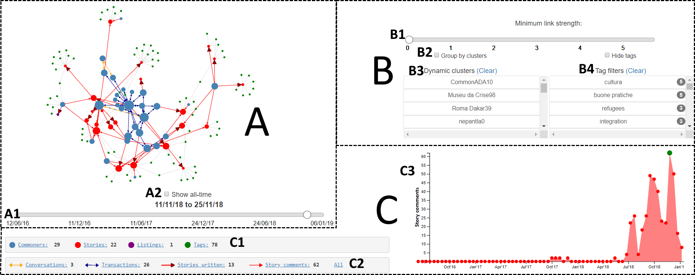

====================
Javascript functions
====================

commonfare.net data
===========================
Two sets of Javascript files are needed for the admin dashboard and the personal commonshare visualisations respectively.

Admin dashboard files
---------------------------

admin.js
^^^^^^^^^^^^^
Main file containing functions for loading, drawing and interacting directly with the force-directed graph (**A**)

.. js:autofunction:: loadDataFiles
.. js:autofunction:: mouseOverNode

forces.js
^^^^^^^^^^^^^
Contains details of the two forces used to layout the network graph, and the functions to toggle between them. 

.. js:autofunction:: toggleGroups
.. js:autofunction:: forceCluster

widgets.js
^^^^^^^^^^^^^
Functions that control the behaviour of the dashboard 'widgets' (e.g., sliders, list boxes, checkboxes) that adjust the graph in some way

.. js:autofunction:: toggleTags
.. js:autofunction:: toggleDate
.. js:autofunction:: populateListBoxes
.. js:autofunction:: addDateSlider
.. js:autofunction:: addStrengthSlider
.. js:autofunction:: updateStrengthSlider

arrowgraphics.js
^^^^^^^^^^^^^
Functions for additional graphical elements of graph links - specifically, the rendering of arrow heads and multi-coloured dashed arrow lines

.. js:autofunction:: drawArrowHeads
.. js:autofunction:: addDashedArrowLines

areachart.js
^^^^^^^^^^^^^
Functions that render and update the area chart tracking the number of nodes/edges of different types over time

.. js:autofunction:: drawAreaChart
.. js:autofunction:: drawNewChart
.. js:autofunction:: areazoomed

Personal visualisation files
-----------------------------

.. image:: indiviz.png
    :scale: 40 %
    :align: center

personalvis.js
^^^^^^^^^^^^^^^
Some stuff in here about the personal visualisation

donut.js
^^^^^^^^^^^^^
Everything for drawing and interacting with the donut representation

.. js:autofunction:: donut.plotDonut
.. js:autofunction:: donut.updateDonut
.. js:autofunction:: calculateTextPath
.. js:autofunction:: addInfoText
.. js:autofunction:: interactionsOfType
.. js:autofunction:: generateArcs
.. js:autofunction:: generateBubbles
.. js:autofunction:: positionCommonshareText
.. js:autofunction:: positionReturnText

linechart.js
^^^^^^^^^^^^^
Everything for drawing and interacting with the line chart representation

.. js:autofunction:: populateCore
.. js:autofunction:: populateAvg
.. js:autofunction:: plotLine
.. js:autofunction:: addLegend
.. js:autofunction:: legendClick
.. js:autofunction:: zoomed
.. js:autofunction:: mousemove

All other data
======================
Non-commonfare data doesn't make use of many features in the network and personal visualisations. Trimmed-down files used for visualising generic data
are found in the ``js/generic/`` directory. For example, the admin dashboard does not contain an area chart or tag filtering. Also, the personal visualisation
consists of only the line chart without the donut.

These files are commented but not documented with JSDoc as the function names and purposes are generally the same. 
