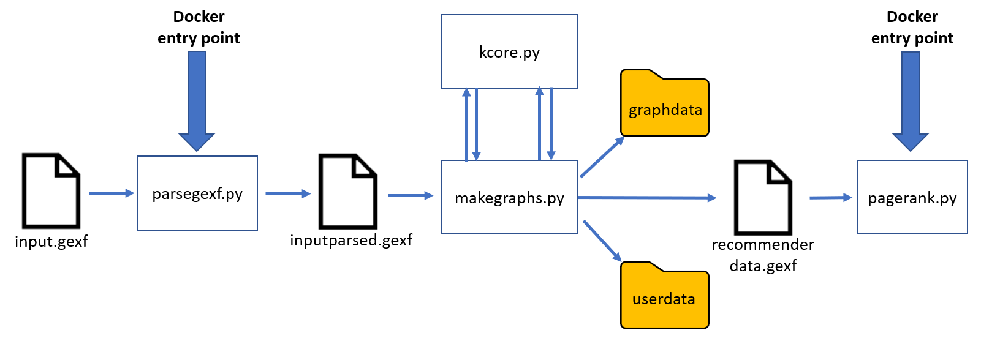

=================
 Python functions
=================
This diagram gives a basic summary of how the Python modules interact. Both ``parsegexf.py`` and ``pagerank.py`` expose their methods as a web API for :ref:`Running from
Docker`. Running from the command line is described in :ref:`Running commonshare`.

parsegexf.py
===================
This contains method for the initial parsing phase of commonfare.net platform data. These methods refer to ``parsegexf.py`` in the ``python/`` directory, but the
version in ``python_generic/`` performs similar operations. 
 
.. automodule:: parsegexf
   :members:
   
makegraphs.py
===================
.. automodule:: makegraphs
   :members:
   
kcore.py
===================
.. automodule:: kcore
   :members:
   
pagerank.py
===================
.. automodule:: pagerank
   :members:

simulation.py
==============
.. automodule:: simulation
    :members: