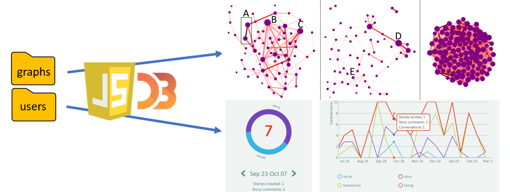

.. Commonshare documentation master file, created by
   sphinx-quickstart on Mon Apr 15 16:59:48 2019.
   You can adapt this file completely to your liking, but it should at least
   contain the root `toctree` directive.

.. role:: underline
    :class: underline

Commonshare documentation
=======================================
This documentation provides a guide to the setup, running, deployment and customisation of the commonshare project. 
If you have any questions or issues, please `contact me <mailto:danieljrough@gmail.com>`_.

Summary
--------
The Python sub-project takes a GEXF representation of a dynamic or static social network, and computes an objective metric of reputation for each user at each
instance of time, using Social Network Analysis algorithms included in the NetworkX Python library.
Files representing the dynamic graph at different time steps, as well as files for each user's contribution history, are output in JSON format.

    
The Javascript sub-project takes these JSON files as input to information visualisations created with the D3 library. These visualisations aim to display
the evolution of a dynamic social network over time, as well as the dynamics of individuals' contributions.

    
Contents
---------
.. toctree::
   :maxdepth: 2
    
   usage/setup
   usage/running
   usage/deployment
   usage/parameters
   functions/python
   functions/javascript

